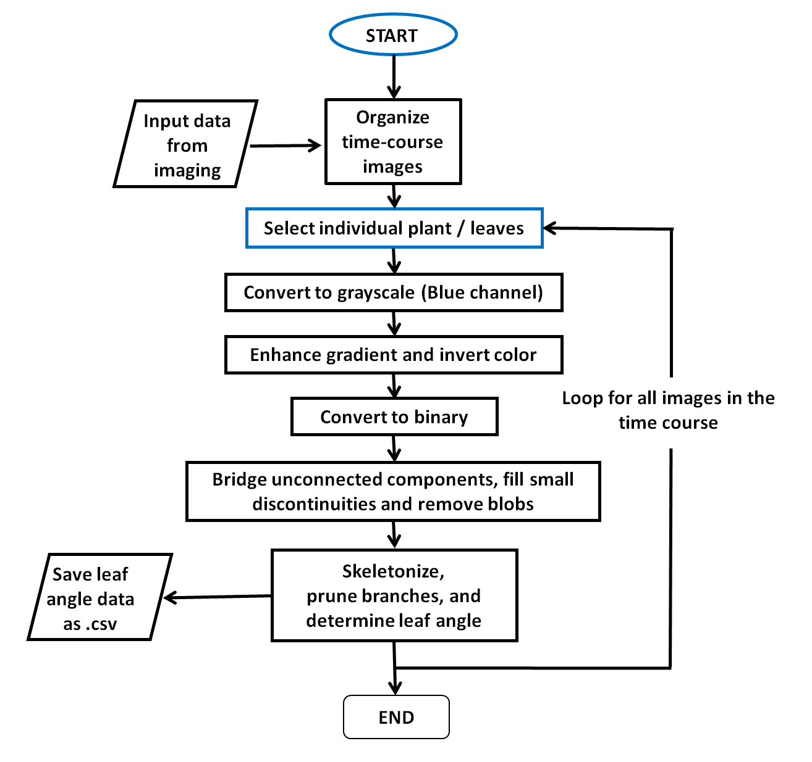

# Leaf-Angle-eXtractor
A MATLAB based framework for leaf angle measurements from image data

*Image Processing Framework*
A. Separation of Foreground and Background
B. Identifying a Single Plant and Leaves of Interest
C. Identifying Leaf Angle 
D. Data Output and graphical interface

